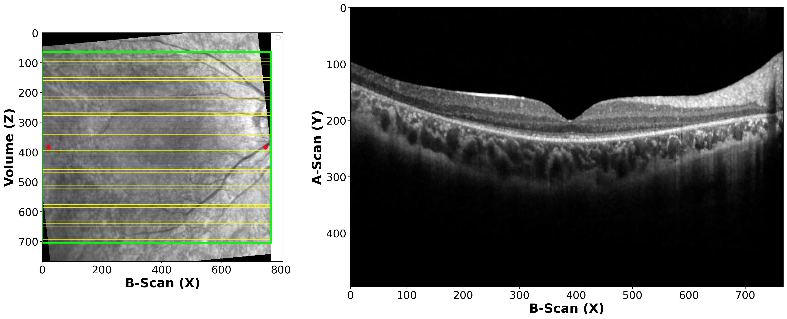
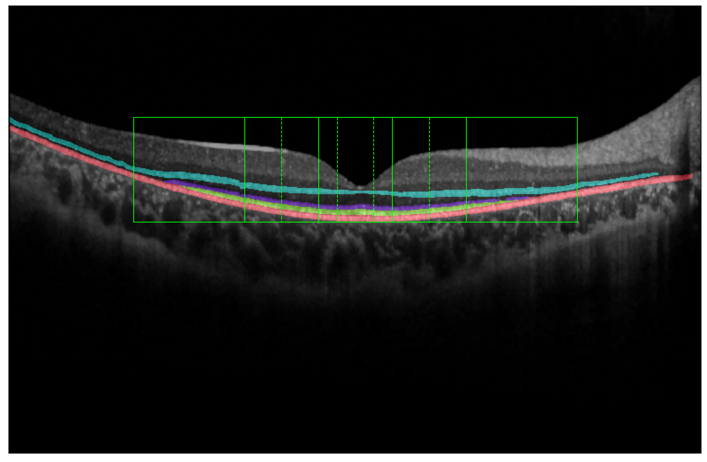

# OCT Layer Segmentation

Welcome to the documentation for training segmentation models for OCT layer segmentation!

### OCT Volume B-Scan


This image shows an OCT volume B-scan, providing a detailed view of the retinal structure. 

### Layer Segmentation


The above image illustrates the segmentation of different layers in the OCT scan, which is a crucial step in identifying and extracting relevant biomarkers. 


## Execution Instructions

To execute the main.py script, follow these steps:

1. Install the required dependencies by running `pip install -r requirements.txt`.
2. Open a terminal and navigate to the project directory.
3. Run the command `python main.py` to start the training process.

## Configuration File (config.yaml)

The `config.yaml` file contains all the necessary parameters for training the segmentation models. It includes options for adjusting the network architecture, data preprocessing, and training hyperparameters. Make sure to modify this file according to your specific requirements before running the training script.

## Statistics Notebook (statistics.ipynb)

The `statistics.ipynb` notebook provides a detailed analysis of the trained models' performance. It includes various statistical metrics, visualizations, and evaluation techniques to assess the accuracy and robustness of the segmentation results. Feel free to explore this notebook to gain insights into the trained models' performance.

## OCT Processing Notebook (oct_processing.ipynb)

The `oct_processing.ipynb` notebook focuses on preprocessing and data augmentation techniques specific to OCT images. It provides step-by-step instructions on how to preprocess the input data, apply various augmentation techniques, and prepare the dataset for training the segmentation models. This notebook is a valuable resource for understanding the data processing pipeline in OCT layer segmentation.

Please refer to the respective documentation and notebooks for more detailed information and instructions.

## Citation

If you find this project useful, please consider citing it using the following BibTeX entry:

```bibtex
@article{OCT,
    title={Title},
    author={Pinedo-Diaz, German},
    journal={Journal Name},
    year={2024},
    volume={Volume},
    number={Number},
    pages={Pages},
    doi={DOI}
}
```

Thank you for your support!
